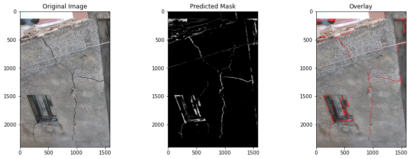

# Crack-pattern-identification-in-masonry-buildings-via-remote-sensing-and-deep-learning-technique



## Overview
This project leverages a U-Net-based deep learning model to detect cracks in reinforced concrete buildings. The model is trained on a custom dataset of images, and it uses patch-based predictions that are reassembled to generate a final segmentation mask. Additionally, a dedicated script helps create a dataset for training and evaluation.

## Project Structure
The project is organized as follows:

```
2_U_NET_CRACK_DETECTION/
│
├── 2_UNET.py                   # Script for training the U-Net model.
├── 3_predict.py                # Script for making predictions using the trained model.
├── 4_metrics_evaluation.py      # Script for evaluating the model performance.
├── dataset/
│   ├── train/
│   │   ├── images/              # Training images.
│   │   └── masks/               # Corresponding masks for the training images.
│   └── val/                    # Validation data.
│
├── dataset_creation/
│   ├── dataset_creation.py      # Script for creating the dataset.
│   └── output_bbox.csv          # CSV file with bounding box information.
│
├── evaluation/
│   ├── confusion_matrix.png     # Confusion matrix image.
│   ├── evaluation_metrics.txt   # Text file with evaluation metrics.
│   └── metrics_plot.png         # Plot of the evaluation metrics.
│
├── output/                      # Output directory for results.
├── prediction/                  # Directory with predictions.
└── README.md                    # Project description file.
```

## Installation
To set up the project environment, make sure you have Python 3.8 or above. Then, install the required dependencies:

```bash
pip install -r requirements.txt
```

## Usage

### Training the Model
To train the U-Net model, run the following script:

```bash
python 2_UNET.py
```

This script will read the images from the `dataset/train` directory and train the model using the U-Net architecture. The trained model will be saved in the `output/` directory.

### Making Predictions
To make predictions using the trained model, use:

```bash
python 3_predict.py
```

This script generates segmentation masks for new images using the trained model. It processes the images in patches, reassembles them, and saves the final result.

### Dataset Creation
If you need to create a dataset, you can use:

```bash
python dataset_creation.py
```

This script generates the required images and annotations for training and testing.

### Evaluation
To evaluate the model performance, run:

```bash
python 4_metrics_evaluation.py
```

This script calculates various metrics, such as Intersection over Union (IoU), F1 Score, Precision, Recall, and Accuracy, and saves the results in the `evaluation/` directory.

## Requirements
Please refer to the `requirements.txt` file for the complete list of dependencies.

